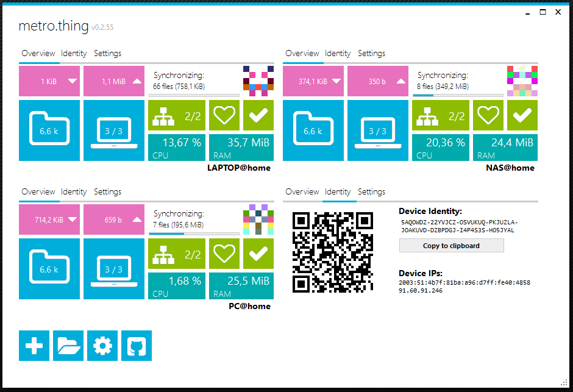
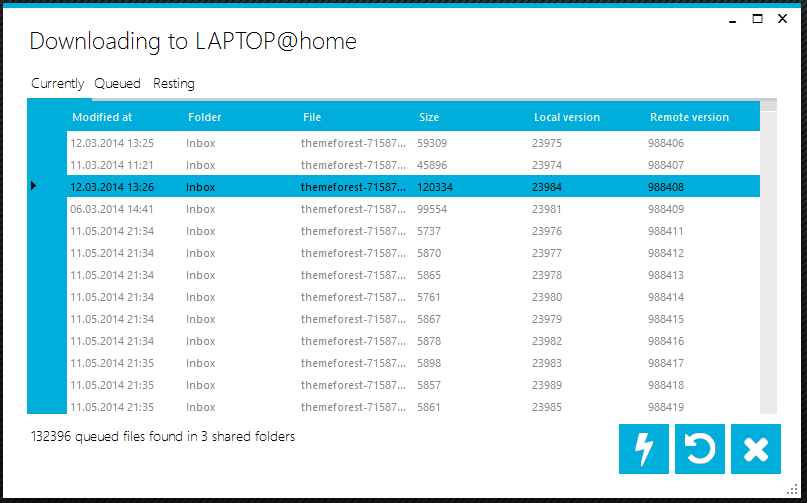
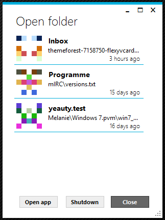

metro.thing
===========

Introduction
------------

metro.thing is a Windows UI to connect [Syncthing](https://syncthing.net/) instances through their REST API.

**_Notice: The current version is not yet compatible with Syncthing v0.11.x and I'm working on a fix, but due to time constraints this might take some time._**

Features in the preview include:

 - Monitoring:
    - CPU / RAM usage
    - Connectivity (ICMP ping and API ping)
    - Up- and download speeds
    - Synchronization progress on every node
    - Connected discovery nodes
    - Total folder and device count (with smaller statistics)
 - Management:
    - View download queues and bump files to the top
 - Device ID:
    - Copy to clipboard
    - QR code display
 - Other:
    - Use notification icon to open up folders that where detected locally.
    - Restarting and upgrading Syncthing

This app is a first prototype of a fast, responsive and aggregated alternative to the default web GUI. As C# is not my first language, this must be considered a hobby project. Most parts I learn or relearn as I move along.

Screenshots
-----------

This is the main screen. It shows four different Syncthing installations that are connected to the UI. Every element will give you a short and usefull overview over the different aspects available, like transfer speeds, file count, availability of the discovery services and overall hardware usage. The identity pane will give you the QR code and all detected IP addreses that are currently available.

This is download queue managment for a given instance. You can see which files are currently inbound, queued after that or rest until later. You can select single files to push them to the top of the queue.

The notification menu will give you a fast overview of the last downloaded items per shared folder, as well as a shortcut to open the shared folder itself or the folder the last downloaded item went into.

Requirements
------------

This app requires .NET 4.5 installed to run.

Installation
------------

ZIP and Installer releases can be found on [github.com](https://github.com/kreischweide/metrothing/releases).

Note: The installer version contains an auto-update mechanism. The ZIP installation does not connect back home, even version checks are ommited.

Building
--------

Building a current version from the source code is pretty straight forward, just grab [Visual Studio Community 2013](https://www.visualstudio.com/en-us/products/visual-studio-community-vs.aspx), fire it up, load the solution and build it.

Connecting
----------

You need three things to connect to the REST API:

 1. A direct connection to the instance. Make sure the GUI port is not bound to localhost (127.0.0.1) but to either the local IP or 0.0.0.0. Open the web GUI of synthing if you are unsure about the hostname and port of your instance. Note that those settings might be overridden by various wrappers, like SyncTrayzor. Check in the settings of your wrapper to be sure.

 2. The Syncthing instance API key. This can be viewed and generated through the web GUI.

 3. Luck. This is a very early preview version, I have no idea what could go wrong. At least only read-only API queries will be sent to the Syncthing instance (except for the version upgrade mechanism) so there should not break anything.

Known problems
--------------

 1. If you alter the path of the executable file, the settings will be lost. As there is no installer right now, this is a drawback, but it's an alpha.
